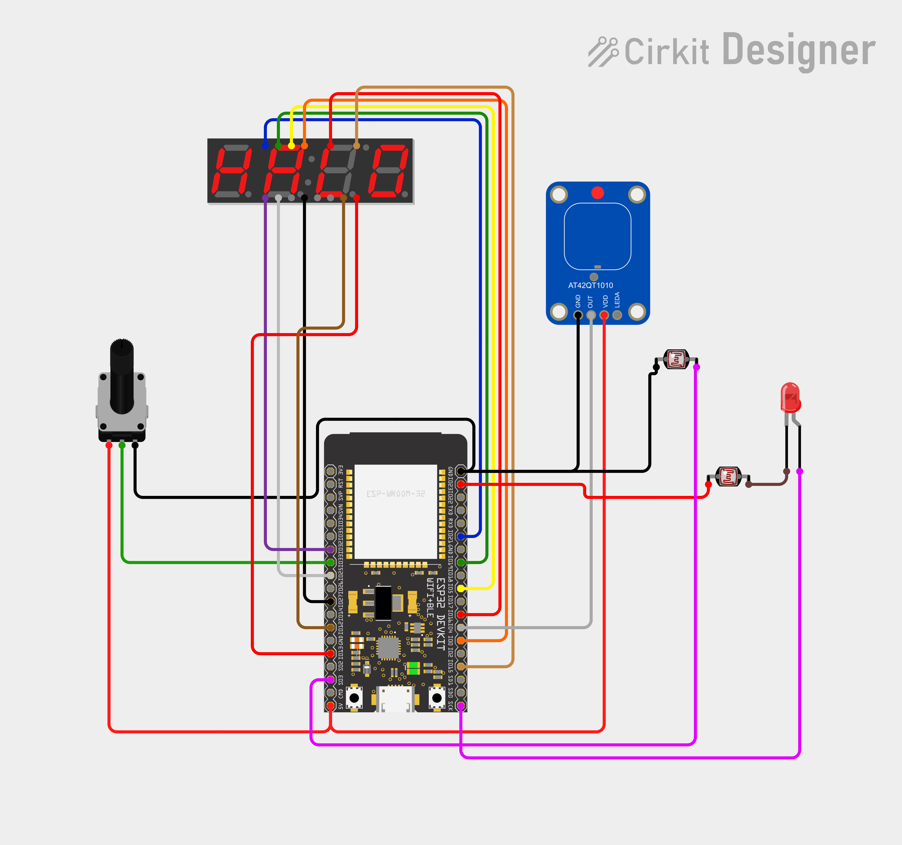

# cosmos
Completly Omnipotent Sport Motivation Optical System - (i.e. a nice thingy to count door passes)

### Description

Basically a LASER beam shooting at a photoreceptor by bouncing off a mirror.

Everytime something break the LASER beam, a counter is incremented and displayed on the 4-digits 7-segments display.

Then you do what you want with it. I personnaly do 1 pull-up & 1 push-up for every passes.

### NOTE :
Pin 13 is dead due to faulty resistor